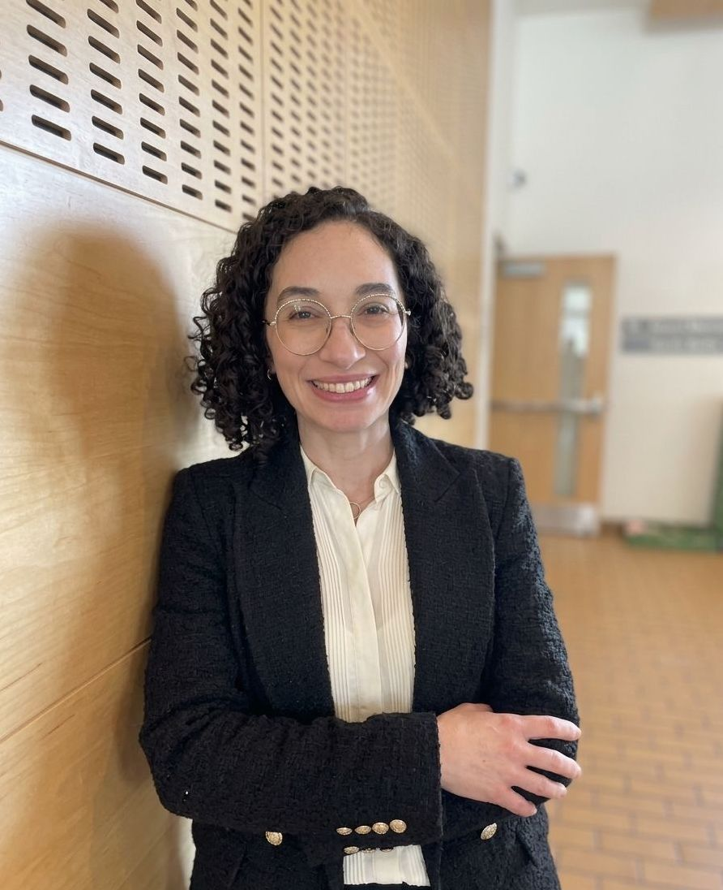

::: {.hero}

:::: {.grid .hero-grid}

::: {.g-col-7}

# Clinical Psychology and Longitudinal Research

I am a Denmark-based researcher and cognitive-behavioural therapist from São Paulo, Brazil. My work focuses on emotion regulation, affective processes, cannabis use, sleep, and intensive longitudinal methods.

[See my research](research.qmd){.btn .btn-primary}

:::

::: {.g-col-5}

{.hero-photo}

:::

::::

:::

:::: {.grid}

::: {.g-col-8}

## Research focus

My research examines how emotional and behavioural processes unfold in real life, with a particular focus on:

- emotion regulation and affect dynamics
- cannabis use and related health outcomes
- sleep and mental health
- intensive longitudinal methods (ESM/EMA)
- reproducible quantitative research

:::

::: {.g-col-4}

## Latest

- PhD completed in Psychology and Behavioural Sciences at Aarhus University
- Ongoing work on cannabis use, affect, emotion regulation, and sleep
- Publications and current projects available on this website

:::

::::